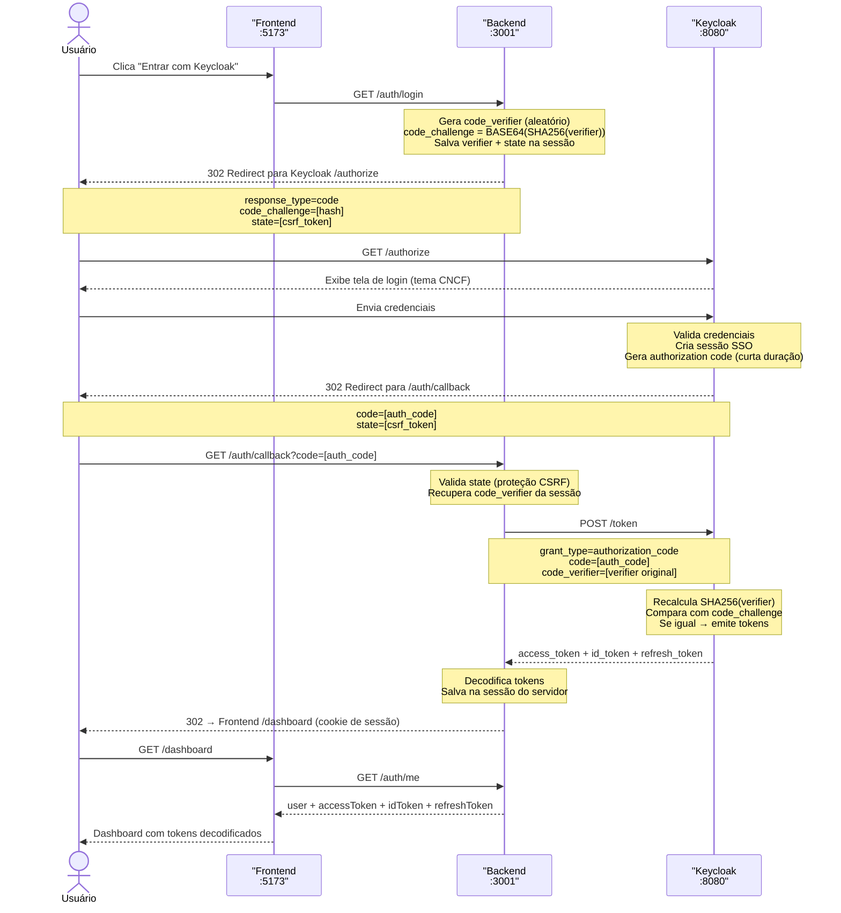
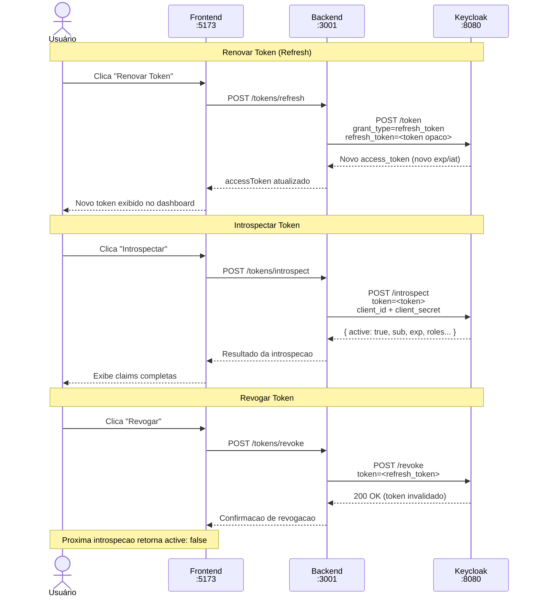
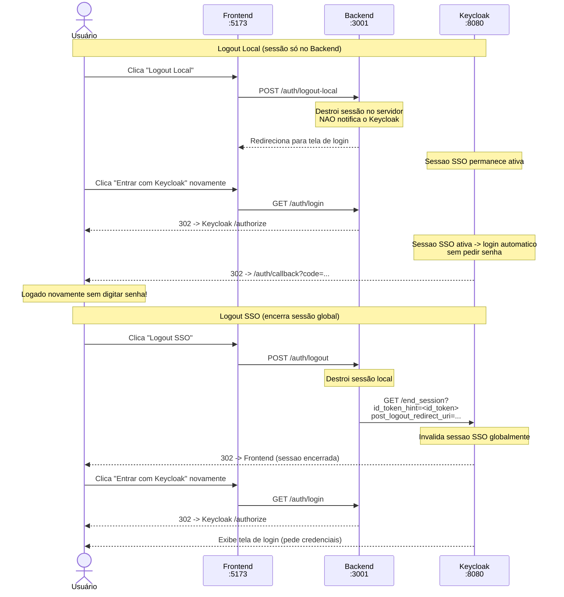

# ☁ Cloud Native Demo — Keycloak

> Aplicação educacional que demonstra autenticação moderna com **Keycloak** usando **OIDC / OAuth 2.0**.


---

## Arquitetura

```text
┌────────────────────────────────────────────────────────────┐
│                      Browser / Aluno                        │
│                                                             │
│  ┌──────────────────┐  ┌────────────────┐  ┌───────────┐  │
│  │  Frontend        │  │  Grafana       │  │  Keycloak │  │
│  │  React + Vite    │  │  :3000         │  │  Admin UI │  │
│  │  :5173           │  │  (OIDC login)  │  │  :8080    │  │
│  └────────┬─────────┘  └───────┬────────┘  └─────┬─────┘  │
└───────────┼────────────────────┼────────────────-─┼────────┘
            │ OIDC redirect      │ OIDC redirect    │
   ┌─────────▼────────────────────▼─────────────────▼────────┐
   │                Docker Network: cloudnative-demo           │
   │                                                           │
   │  ┌──────────────────┐       ┌────────────────────────┐   │
   │  │  Backend          │       │  Keycloak               │   │
   │  │  Node.js + Express│◄─────►│  Identity Provider     │   │
   │  │  :3001            │       │  :8080                  │   │
   │  │  + Swagger UI     │       │  realm: cloudnative     │   │
   │  └──────────────────┘       │  clients: demo-app       │   │
   │                              │           grafana        │   │
   │  ┌──────────────────┐       └────────────────────────┘   │
   │  │  Grafana          │◄──── token/userinfo (interno)      │
   │  │  :3000            │                                    │
   │  └──────────────────┘                                    │
   └───────────────────────────────────────────────────────────┘
```

---

## Fluxos de Autenticação

### Authorization Code + PKCE



---

### Operações de Token



---

### Logout Local vs SSO



---

## Stack

| Camada | Tecnologia |
|--------|-----------|
| Identity Provider | Keycloak 26.6 (Docker) |
| Backend / API | Node.js + Express + openid-client |
| Documentação API | Swagger UI (swagger-jsdoc) |
| Frontend | Vite + React |
| Observabilidade | Grafana (OIDC via Keycloak) |
| Tema de Login | Custom (inspirado no CNCF) |

---

## Pré-requisitos

- [Docker + Docker Compose](https://docs.docker.com/get-docker/)
- [Node.js 20+](https://nodejs.org/) (para modo dev local)

---

## Início Rápido

### Modo Docker (tudo em containers)

```bash
cd keycloak-demo
docker compose up
```

Aguarde o Keycloak inicializar (~30s) e acesse:

| Serviço | URL |
|---------|-----|
| 🌐 Frontend | http://localhost:5173 |
| 📖 Swagger UI | http://localhost:3001/api-docs |
| 🔑 Keycloak Admin | http://localhost:8080 |
| 📊 Grafana | <http://localhost:3000> |

### Modo Desenvolvimento (recomendado para aula)

**Terminal 1 — Keycloak:**
```bash
docker compose up keycloak
```

**Terminal 2 — Backend:**
```bash
cd backend
npm install
npm run dev
```

**Terminal 3 — Frontend:**
```bash
cd frontend
npm install
npm run dev
```

---

## Usuários de Teste

| Usuário | Senha | Role |
|---------|-------|------|
| `joao.banczek` | `joao123` | instrutor |
| `maria.aluna` | `maria123` | aluno |

**Admin Keycloak:** `admin` / `admin123`

---

## Roteiro da Aula

### 1. Conceito: OIDC Discovery

Abra no browser e explique o documento de descoberta:
```
http://localhost:8080/realms/cloudnative/.well-known/openid-configuration
```

Mostre que o Keycloak publica todos os endpoints automaticamente. O backend usa isso via:
```javascript
const issuer = await Issuer.discover(issuerUrl)
// → descobre authorization_endpoint, token_endpoint, jwks_uri, etc.
```

---

### 2. Fluxo de Login — Authorization Code + PKCE

1. Clique em **"Entrar com Keycloak"** no frontend
2. Observe o redirecionamento para `http://localhost:8080/realms/cloudnative/protocol/openid-connect/auth`
3. Na URL, mostre os parâmetros:
   - `response_type=code` — solicitamos um código, não o token direto
   - `code_challenge` — hash PKCE (pode ser interceptado — não é segredo)
   - `state` — proteção CSRF
4. Faça login com `joao.banczek` / `joao123`
5. Observe o redirect de volta com `?code=...` na URL

**Por que PKCE?**
> O `code_verifier` fica no servidor. Mesmo que o `code` seja interceptado, o atacante não tem o `code_verifier` para trocá-lo por tokens.

---

### 3. Exploração dos Tokens

Após o login, o dashboard mostra 3 tokens:

#### 🎟️ Access Token (JWT)
- Clique na aba **"Access Token"**
- Mostre as claims importantes:
  - `sub` — ID único do usuário
  - `exp` / `iat` — expiração e emissão (timestamp Unix)
  - `iss` — quem emitiu (URL do Keycloak)
  - `aud` — para quem é o token (client_id)
  - `realm_access.roles` — roles do realm (ex: `instrutor`)
  - `scope` — permissões concedidas
- Clique em **"JWT Bruto"** e explique as 3 partes: `header.payload.signature`
- Cole em [jwt.io](https://jwt.io) para visualizar

#### 🪪 ID Token
- Similar ao Access Token, mas focado em **identidade** (quem é o usuário)
- Contém `name`, `email`, `given_name`, etc.
- **Diferença chave**: Access Token → autorização de recursos; ID Token → identidade do usuário

#### 🔄 Refresh Token
- Token **opaco** (não é JWT — não pode ser decodificado pelo cliente)
- Usado para obter novos Access Tokens sem novo login

---

### 4. Operações de Token (via botões ou Swagger)

#### Renovar Token (`POST /tokens/refresh`)
1. Clique em **"Renovar Token"**
2. Observe o log da requisição: `grant_type=refresh_token`
3. O novo Access Token tem um novo `iat` (emitido em) e novo `exp`
4. Mostre no Swagger: `http://localhost:3001/api-docs` → seção "Tokens"

#### Introspectar Token (`POST /tokens/introspect`)
1. Clique em **"Introspectar Access Token"**
2. Observe a resposta: `active: true` com claims completas
3. É uma chamada **servidor-para-servidor** (usa `client_id:client_secret`)
4. Diferença de validação local (verifica assinatura) vs introspeção (pergunta ao Keycloak se está ativo)

#### Revogar e Introspectar (demonstração mais impactante)
1. Clique em **"Revogar Refresh Token"**
2. Imediatamente clique em **"Introspectar Refresh Token"**
3. Observe: `active: false` ✓ — o token foi invalidado no servidor

#### Buscar UserInfo (`GET /tokens/userinfo`)
- Chama o endpoint UserInfo com o Access Token
- Sempre retorna dados atualizados (diferente das claims do JWT que são fixas na emissão)

---

### 5. Logout

#### Comportamento dos Dois Tipos

**Logout Local** (botão "Logout Local"):
- Destrói apenas a sessão neste servidor
- Sessão SSO no Keycloak **continua ativa**
- Ao clicar em "Entrar com Keycloak" novamente → login automático (sem pedir senha)
- **Demonstre isso!** É o comportamento SSO em ação

**Logout SSO** (botão "Logout SSO"):
- Envia `id_token_hint` ao endpoint `end_session` do Keycloak
- Keycloak encerra a sessão globalmente
- Ao tentar entrar novamente → pede credenciais

---

### 6. Grafana com SSO

Grafana autentica via Keycloak usando OIDC. Role mapping automático:

- `instrutor` → **Admin** no Grafana
- `aluno` → **Viewer** no Grafana

**Demonstração:**

1. Acesse `http://localhost:3000`
2. Clique em **"Sign in with Keycloak"**
3. Login com `joao.banczek` → entra como Admin
4. Logout e login com `maria.aluna` → entra como Viewer
5. Mostre que **nenhuma senha Grafana foi criada** — identidade vem do Keycloak

> Conceito-chave: um único Identity Provider para múltiplas aplicações = SSO real.

---

### 7. Tema Customizado

O Keycloak exibe um tema inspirado no CNCF (Cloud Native Computing Foundation).

Para ver o tema:
- Acesse: `http://localhost:8080/realms/cloudnative/account`
- Ou simplesmente faça logout SSO e veja a tela de login

O tema está em: `keycloak/themes/cloudnative-theme/`

---

## Endpoints da API

### Autenticação
| Método | Rota | Descrição |
|--------|------|-----------|
| GET | `/auth/login` | Inicia fluxo Authorization Code + PKCE |
| GET | `/auth/callback` | Callback OAuth (chamado pelo Keycloak) |
| GET | `/auth/me` | Dados da sessão e tokens decodificados |
| POST | `/auth/logout` | Logout SSO (encerra sessão no Keycloak) |
| POST | `/auth/logout-local` | Logout apenas local |

### Tokens
| Método | Rota | Descrição |
|--------|------|-----------|
| POST | `/tokens/refresh` | Renovar access token |
| POST | `/tokens/introspect` | Introspectar token (verificar status no Keycloak) |
| POST | `/tokens/revoke` | Revogar token permanentemente |
| GET | `/tokens/userinfo` | Buscar dados do usuário no Keycloak |
| GET | `/tokens/endpoints` | Listar endpoints OIDC descobertos |

> 📖 Documentação interativa completa: **http://localhost:3001/api-docs**

---

## Estrutura do Projeto

```
keycloak-demo/
├── docker-compose.yml              # Orquestração dos serviços
├── .env.example                    # Variáveis de ambiente (modelo)
├── keycloak/
│   ├── realm-export.json           # Realm pré-configurado (importado automaticamente)
│   └── themes/cloudnative-theme/  # Tema de login customizado
│       └── login/
│           ├── theme.properties
│           └── resources/
│               ├── css/login.css   # Estilos CNCF
│               └── img/logo.svg    # Logo Cloud Native
├── backend/
│   ├── src/
│   │   ├── app.js                  # Express + Swagger setup
│   │   ├── swagger.js              # Configuração OpenAPI
│   │   ├── lib/keycloak.js         # OIDC Discovery + client
│   │   └── routes/
│   │       ├── auth.js             # Login, callback, logout, /me
│   │       └── tokens.js           # Refresh, introspect, revoke, userinfo
│   └── .env                        # Variáveis de ambiente (dev)
└── frontend/
    ├── src/
    │   ├── App.jsx                 # Dashboard principal
    │   ├── api.js                  # Chamadas ao backend
    │   ├── styles.css              # Estilos globais (CNCF-inspired)
    │   └── components/
    │       ├── TokenCard.jsx       # Visualização de JWT decodificado
    │       └── EndpointLog.jsx     # Log de chamadas HTTP ao Keycloak
    └── vite.config.js
```

---

## Notas Importantes

> ⚠️ **Esta aplicação é apenas para fins educacionais.**
> - Sessões em memória (não usar em produção — reiniciar container apaga sessões)
> - Keycloak em `start-dev` (sem persistência de banco de dados)
> - Client secret exposto no código (em produção, use variáveis de ambiente seguras)
> - Para produção, use o padrão BFF (Backend For Frontend) com cookies httpOnly seguros

---

## Referências

- [Documentação Keycloak](https://www.keycloak.org/docs/latest/)
- [Especificação OpenID Connect](https://openid.net/specs/openid-connect-core-1_0.html)
- [RFC 6749 — OAuth 2.0](https://tools.ietf.org/html/rfc6749)
- [RFC 7636 — PKCE](https://tools.ietf.org/html/rfc7636)
- [CNCF — Cloud Native Computing Foundation](https://www.cncf.io/)
